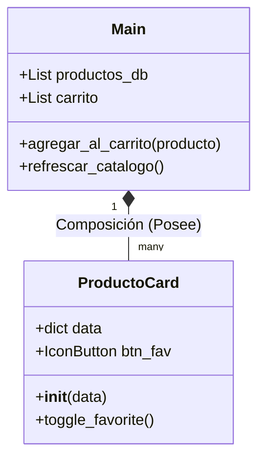

# Documentación Técnica: Aplicación Místico Tech
## Introducción
El presente documento detalla la implementación de una interfaz de usuario para una tienda tecnológica utilizando el framework Flet. El proyecto se enfoca en la modularización de componentes mediante el uso de clases personalizadas, la gestión de estados para un carrito de compras y la implementación de un diseño responsivo que se adapta a diferentes resoluciones de pantalla.

## 1. Diagrama de Clases
La arquitectura del software se basa en la interacción entre la clase principal que gestiona la página y la clase componente que renderiza los productos.
main(page: ft.Page): Es el punto de entrada. Contiene la lista de datos (productos_db), la lógica del carrito y el contenedor principal (ResponsiveRow).
ProductoCard(ft.Container): Es el componente hijo. Recibe datos específicos de un producto y una función de callback (on_add_to_cart) para comunicarse con la clase principal cuando el usuario interactúa con el botón de compra.

## 2. Explicación Detallada de la Herencia en ProductoCard

La herencia es un pilar fundamental de la **Programación Orientada a Objetos (POO)** que permite a una clase nueva (clase hija) adquirir las propiedades y métodos de una clase existente (clase base). En este proyecto, la herencia es la herramienta clave para crear componentes de interfaz de usuario (UI) personalizados y reutilizables.

### Clase Base Seleccionada: `flet.Container`
Un **Container** en Flet es un control versátil diseñado para contener otros controles y aplicarles estilos visuales complejos. Es análogo a un `<div>` en HTML o un `UIView` en iOS, pero con capacidades de estilización integradas.

### Justificación Técnica de la Elección
La elección de `ft.Container` como clase base para `ProductoCard`, en lugar de opciones como `ft.UserControl`, se basa en los siguientes puntos:

1. **Capacidades de Estilización Nativa:**
   La tarjeta requiere una identidad visual clara (bordes redondeados, sombras, color de fondo). `ft.Container` posee estas propiedades como atributos nativos (`bgcolor`, `border_radius`, `padding`, `shadow`). Al heredar de él, definimos el aspecto visual directamente en el constructor `__init__` invocando a `super().__init__()`.

2. **Contraste con UserControl:**
   Si hubiéramos usado `ft.UserControl`, habríamos tenido que crear un `ft.Container` dentro del método `build()`. Esto añadiría una capa extra innecesaria en el árbol de controles. La herencia directa de `Container` **aplana la estructura**, haciendo el renderizado más eficiente.

3. **Manejo Simplificado del Layout:**
   `ProductoCard` hereda la capacidad de organizar controles hijos. Utilizamos la propiedad `content` para albergar una `ft.Column`, organizando verticalmente la imagen, el nombre, la descripción y el precio de forma natural.

4. **Encapsulamiento y Reutilización:**
   La clase encapsula toda la complejidad: datos (`self.data`), lógica visual e interacciones. Esto permite instanciar `ProductoCard(datos, callback)` en cualquier parte de la app sin reescribir código de UI.

### Implementación y Flujo de Trabajo
Al heredar de `ft.Container`, el componente se integra como un control nativo del framework:

* **Instanciación Directa:** Se añaden instancias de `ProductoCard` directamente a `page.add()` o `controls.append()` sin necesidad de adaptadores.
* **Ejemplo de Flujo:**
    1. **Definición:** `class ProductoCard(ft.Container):`
    2. **Constructor:** Configura el "caparazón" visual mediante `super().__init__(border_radius=15, bgcolor=ft.Colors.WHITE, ...)` y define el contenido interno.
    3. **Uso:** Se recorre `productos_db` y se añade cada instancia al `ResponsiveRow`.

---
**Conclusión:** La herencia de `ft.Container` dota a la tarjeta de una identidad visual potente desde su concepción, mejora la eficiencia del árbol de controles y promueve un código limpio y modular.
## 3. Gestión de Recursos Locales (Assets)

La correcta administración de archivos estáticos (imágenes, fuentes, iconos) es vital para la portabilidad de una aplicación. En Flet, esto no se limita a colocar archivos en una carpeta, sino que requiere una sincronización entre la estructura de directorios y el motor de renderizado del framework.

---

## Estructura del Proyecto

Para este proyecto, se implementó la **Arquitectura de Recursos Estándar**, asegurando que todos los elementos visuales residan en un directorio dedicado accesible de forma relativa por el código fuente.

- **Directorio de Origen:**  
  Se configuró una carpeta denominada `/assets`, ubicada en la raíz del proyecto, al mismo nivel jerárquico que el archivo `main.py`.

- **Contenido:**  
  Dentro de este directorio se almacenan las imágenes de los productos:
  - `laptop.png`
  - `mouse.png`
  - `teclado.png`
  - `monitor.png`
  - `audifinos.png`

---

## Vinculación y Registro del Directorio
Para que el framework "monte" estos archivos y los haga disponibles durante la ejecución, se utilizó el parámetro `assets_dir` en el punto de entrada de la aplicación.
    import flet as ft
    ft.app(target=main, assets_dir="assets")
### Importancia técnica

- Flet crea un servidor interno de archivos
- Se genera un mapeo entre ruta física y virtual
- Evita errores al cargar imágenes

> Si no se configura `assets_dir`, el framework intentará buscar las imágenes como rutas absolutas del sistema o URLs externas, lo que provocará errores en la carga de recursos.
---
### Ventajas de este método
1. Portabilidad  
   El proyecto funcionará en Windows, Linux, macOS o Android sin modificar el código.
2. Mantenibilidad  
   Si se cambia el nombre del directorio (por ejemplo, de `assets` a `recursos`), solo se actualiza en `ft.app()`.
3. Seguridad  
   Evita exponer rutas locales del sistema de archivos del desarrollador.
---
# EXPLICACION DE COMPONENTE.PY
## Análisis Detallado del Componente ProductoCard

Este componente es una clase personalizada que encapsula tanto el diseño como el comportamiento de una tarjeta de producto individual. Al utilizar Programación Orientada a Objetos (POO), se permite que la aplicación escale de manera organizada.

---

## 1. Definición y Herencia
```python
class ProductoCard(ft.Container):
```
## Análisis Detallado del Componente ProductoCard

Este componente es una clase personalizada que encapsula tanto el diseño como el comportamiento de una tarjeta de producto individual. Al aplicar Programación Orientada a Objetos (POO), se facilita la organización del código y la escalabilidad de la aplicación.

---

## 1. Definición y Herencia

```python
class ProductoCard(ft.Container):
```

La clase `ProductoCard` hereda de `ft.Container`, lo que permite que el componente tenga propiedades visuales como fondo, bordes y sombras directamente manipulables.

---

## 2. El Constructor `__init__`

```python
def __init__(self, producto_data, on_add_to_cart):
    super().__init__()
    self.data = producto_data  
    self.on_add_to_cart = on_add_to_cart
```

* `super().__init__()` inicializa correctamente el componente base de Flet.
* `self.data` almacena la información del producto (nombre, precio e imagen).
* `self.on_add_to_cart` permite comunicar la tarjeta con el carrito mediante una función externa.

---

## 3. Configuración de Estilo (Visuales)

```python
self.border_radius = 15
self.bgcolor = ft.Colors.WHITE
self.padding = 15
self.shadow = ft.BoxShadow(
    blur_radius=10,
    color=ft.Colors.BLACK12,
    offset=ft.Offset(0, 4)
)
```

* `border_radius` define esquinas redondeadas.
* `bgcolor` establece un fondo limpio.
* `padding` agrega espacio interno.
* `shadow` genera efecto de elevación.

---

## 4. Control de Favoritos

```python
self.btn_fav = ft.IconButton(
    icon=ft.Icons.FAVORITE_BORDER,
    icon_color=ft.Colors.RED_400,
    on_click=self.toggle_favorite
)
```

Este botón permite marcar productos como favoritos:

* Usa un icono de corazón vacío inicialmente
* Tiene color rojo
* Ejecuta una función interna al hacer clic

---

## 5. Estructura de Contenido (`self.content`)

El contenido se organiza con `ft.Column`, distribuyendo los elementos verticalmente.

### Imagen

```python
ft.Image(src=self.data["img"], ...)
```

Muestra la imagen del producto desde los recursos.

### Información

Se utilizan controles `ft.Text` para mostrar:

* Nombre del producto
* Descripción
* Precio

### Acciones

Una `ft.Row` organiza los botones:

* Botón de favoritos
* Botón "Agregar"

---

## Resumen de Beneficios Técnicos

* **Modularidad**
  Permite cambiar el diseño desde un solo lugar.

* **Responsividad**
  Se adapta al tamaño del dispositivo mediante el contenedor padre.

* **Encapsulamiento**
  La lógica interna del componente está aislada del resto de la aplicación.
## Análisis de Estructura Visual y Lógica de Interacción

Esta sección del código define la estructura interna de la tarjeta (`self.content`) y su capacidad de respuesta inmediata mediante la función `toggle_favorite`. Aquí se construye tanto la disposición visual como el comportamiento interactivo del componente.

---

## 6. Organización en Columna (`ft.Column`)

```python
self.content = ft.Column(controls=[...], tight=True)
```

Se utiliza una columna para organizar los elementos de forma vertical (de arriba hacia abajo).

* `tight=True`
  Permite que la columna ocupe únicamente el espacio necesario, evitando que la tarjeta se expanda verticalmente de forma innecesaria.

---

## 7. Gestión Responsiva de la Imagen

```python
ft.Image(src=self.data["img"], width=float("inf"), height=150, fit="contain")
```

* `width=float("inf")`
  Hace que la imagen ocupe todo el ancho disponible dentro del contenedor.

* `height=150`
  Mantiene una altura uniforme entre todas las tarjetas.

* `fit="contain"`
  Garantiza que la imagen se ajuste sin recortarse, conservando sus proporciones.

---

## 8. Jerarquía de Texto y Estilo

Se define una jerarquía visual clara para mejorar la legibilidad:

* **Nombre del producto**
  Tamaño de fuente 18 y estilo en negrita para destacar.

* **Descripción**
  Color gris (`GREY_700`) y tamaño 12.
  Se limita con `max_lines=2` para evitar desbordes.

* **Precio**
  Color verde y peso de fuente `w600` para resaltar el costo.

---

## 9. Acciones en Fila (`ft.Row`)

```python
ft.Row(
    alignment="spaceBetween",
    controls=[self.btn_fav, ft.ElevatedButton(...)]
)
```

* `alignment="spaceBetween"`
  Distribuye los elementos en extremos opuestos de la fila.

* **Botón de favoritos**
  Permite marcar productos.

* **Botón "Agregar"**
  Utiliza `ft.ElevatedButton` con icono de carrito.
  Ejecuta la función `on_add_to_cart(self.data)` para enviar el producto seleccionado al carrito.

---

## 10. Lógica de Estado: `toggle_favorite`

```python
def toggle_favorite(self, e):
    self.btn_fav.icon = ft.Icons.FAVORITE if self.btn_fav.icon == ft.Icons.FAVORITE_BORDER else ft.Icons.FAVORITE_BORDER
    self.update()
```

Este método gestiona el estado del botón de favoritos:

* **Evaluación**
  Verifica el icono actual.

* **Alternancia**
  Cambia entre `FAVORITE_BORDER` (vacío) y `FAVORITE` (relleno).

* **Actualización**
  `self.update()` refresca únicamente este componente, evitando recargar toda la interfaz.
## 11. Codigo Completo de Componente.py
```python
import flet as ft

class ProductoCard(ft.Container):
    def __init__(self, producto_data, on_add_to_cart):
        super().__init__()
        self.data = producto_data  
        self.on_add_to_cart = on_add_to_cart
        # Quitamos width=250 para permitir que el grid defina el tamaño
        self.border_radius = 15
        self.bgcolor = ft.Colors.WHITE
        self.padding = 15
        self.shadow = ft.BoxShadow(blur_radius=10, color=ft.Colors.BLACK12, offset=ft.Offset(0, 4))
        
        self.btn_fav = ft.IconButton(
            icon=ft.Icons.FAVORITE_BORDER, 
            icon_color=ft.Colors.RED_400,
            on_click=self.toggle_favorite
        )
        self.content = ft.Column(
            controls=[
                # Imagen que se adapta al ancho disponible
                ft.Image(src=self.data["img"], width=float("inf"), height=150, fit="contain"),
                ft.Text(self.data["nombre"], weight="bold", size=18, color=ft.Colors.BLACK),
                ft.Text(self.data["desc"], size=12, color=ft.Colors.GREY_700, max_lines=2),
                ft.Text(f"${self.data['precio']}", size=18, color=ft.Colors.GREEN, weight="w600"),
                ft.Row(
                    alignment="spaceBetween",
                    controls=[
                        self.btn_fav,
                        ft.ElevatedButton(
                            content=ft.Row([ft.Icon(ft.Icons.ADD_SHOPPING_CART, size=20), ft.Text("Agregar")], tight=True),
                            on_click=lambda _: self.on_add_to_cart(self.data)
                        )
                    ]
                )
            ],
            tight=True
        )

    def toggle_favorite(self, e):
        self.btn_fav.icon = ft.Icons.FAVORITE if self.btn_fav.icon == ft.Icons.FAVORITE_BORDER else ft.Icons.FAVORITE_BORDER
        self.update()
```
# EXPLICACION DE MAIN.PY

## Análisis del Controlador Principal (main.py)

El archivo principal coordina la lógica de negocio y la navegación de la aplicación, aplicando un enfoque de gestión de estado centralizada para mantener coherencia entre la interfaz y los datos.

---

## 1. Configuración del Entorno y Página

```python
def main(page: ft.Page):
    page.title = "Místico Tech - Tech Store"
    page.bgcolor = "#F0F2F5"
    page.theme_mode = ft.ThemeMode.LIGHT
```

* `ft.Page`
  Es el contenedor raíz de la aplicación.

* `page.title`
  Define el título de la ventana.

* `page.bgcolor`
  Establece el color de fondo general.

* `page.theme_mode`
  Configura el tema visual. El modo claro aporta una apariencia limpia y profesional.

---

## 2. Base de Datos Local y Estado

```python
productos_db = [...]  
carrito = []
```

* **Estructura de datos**
  Se utiliza una lista de diccionarios para simular una base de datos de productos.

* **Acceso a datos**
  Permite obtener fácilmente atributos como nombre, precio e imagen.

* **Estado del carrito**
  La lista `carrito` almacena dinámicamente los productos seleccionados.

---

## 3. Lógica de Comunicación (Callback)

```python
def agregar_al_carrito(producto_data):
    carrito.append(producto_data)
    texto_contador.value = f"Carrito ({len(carrito)})"
    page.snack_bar = ft.SnackBar(...)
    page.update()
```

* **Función de callback**
  Se pasa como argumento a cada componente `ProductoCard`.

* **Actualización de estado**
  Se añade el producto al carrito y se actualiza el contador.

* **Retroalimentación al usuario**
  Se muestra un `SnackBar` para indicar que el producto fue agregado.

* **Refresco de interfaz**
  `page.update()` aplica los cambios visuales.

---

## 4. Generación Dinámica de Interfaz

```python
def refrescar_catalogo():
    catalogo_grid.controls.clear()
    for p in productos_db:
        catalogo_grid.controls.append(
            ft.Column(
                [ProductoCard(p, agregar_al_carrito)],
                col={"xs": 12, "sm": 6, "md": 6, "lg": 4}
            )
        )
    page.update()
```

* **Ciclo de instanciación**
  Se recorre la lista de productos y se crea una tarjeta por cada elemento.

* **Render dinámico**
  Se limpia el contenedor y se vuelve a construir el catálogo.

* **Diseño responsivo**
  La propiedad `col` permite adaptar el layout según el dispositivo:

  * `xs: 12` → 1 columna en móviles
  * `sm/md: 6` → 2 columnas en tablets
  * `lg: 4` → 3 columnas en pantallas grandes

---

## 5. Estructura Final con `ft.Stack`

```python
page.add(
    ft.Stack([
        ft.Container(
            content=ft.Column(
                [header, ft.Divider(), catalogo_grid],
                scroll="auto"
            ),
            padding=20
        ),
        ft.Row(
            [panel_carrito],
            alignment="end",
            vertical_alignment="start"
        )
    ], expand=True)
)
```

* **`ft.Stack`**
  Permite superponer elementos en capas.

* **Capa base**
  Contiene el catálogo de productos con scroll.

* **Capa superior**
  El panel del carrito se posiciona encima del contenido.

* **Resultado visual**
  Se logra un diseño moderno donde el carrito aparece como un panel flotante sobre la interfaz principal.
## 6. Arquitectura de Cabecera y Navegación

La cabecera (`header`) funciona como la barra principal de interacción, separando visualmente la identidad de la marca de las acciones del usuario mediante una distribución espacial eficiente.

```python
header = ft.Row(
    alignment="spaceBetween",
    controls=[
        ft.Text("Mistico Tech", size=30, weight="bold", color="black"),
        ft.Row([
            ft.IconButton(ft.Icons.ADD_CIRCLE, icon_color="blue", on_click=abrir_modal_registro),
            ft.ElevatedButton(
                content=ft.Row(
                    [ft.Icon(ft.Icons.SHOPPING_CART), texto_contador],
                    tight=True
                ),
                on_click=mostrar_carrito,
                bgcolor=ft.Colors.BLUE_GREY_900
            )
        ])
    ]
)
```

* `alignment="spaceBetween"`
  Distribuye el contenido en extremos opuestos: título a la izquierda y acciones a la derecha.

* **Composición de botones**
  Se agrupan múltiples controles dentro de una sub-fila (`ft.Row`), demostrando la capacidad de anidación de Flet.

* **Botón de carrito**
  Integra un icono y un contador dinámico (`texto_contador`).

* **Eventos (`on_click`)**
  Conectan la interfaz con funciones de lógica (`abrir_modal_registro`, `mostrar_carrito`).

---

## 7. Panel Lateral del Carrito (Overlay UI)

Se implementa un panel flotante para gestionar las compras sin interrumpir la navegación principal.

```python
panel_carrito = ft.Container(
    content=ft.Column([
        ft.Row([
            ft.Text("Tu Compra", size=24, weight="bold"),
            ft.IconButton(ft.Icons.CLOSE, ...)
        ]),
        ft.Divider(),
        lista_carrito_ui,
        texto_total,
        ft.ElevatedButton("Finalizar Pago", bgcolor=ft.Colors.GREEN, ...)
    ]),
    bgcolor=ft.Colors.WHITE,
    padding=20,
    border_radius=20,
    visible=False,
    width=350,
    shadow=ft.BoxShadow(blur_radius=20, color=ft.Colors.BLACK26)
)
```

* **Visibilidad condicional**
  `visible=False` mantiene el panel oculto hasta que se active.

* **Efecto de elevación**
  La sombra (`BoxShadow`) crea jerarquía visual sobre el contenido principal.

* **Actualización dinámica**
  Antes de mostrarse, el contenido del carrito se reconstruye para reflejar el estado actual.

---

## 8. Estructura Final y Renderizado (`ft.Stack`)

Se utiliza una estructura en capas para superponer el carrito sobre el catálogo.

```python
page.add(
    ft.Stack([
        ft.Container(
            content=ft.Column(
                [header, ft.Divider(), catalogo_grid],
                scroll="auto"
            ),
            padding=20
        ),
        ft.Row(
            [panel_carrito],
            alignment="end",
            vertical_alignment="start"
        )
    ],
    expand=True)
)
```

* **`ft.Stack`**
  Permite superponer elementos (capas).

* **Catálogo**
  Se mantiene como fondo con desplazamiento independiente (`scroll="auto"`).

* **Panel del carrito**
  Se posiciona encima, simulando una interfaz tipo overlay.

* **`expand=True`**
  Hace que la app ocupe todo el espacio disponible.

---

## 9. Inicialización del Sistema

Se inicia la aplicación conectando el controlador principal y la gestión de recursos.

```python
ft.app(
    target=main,
    assets_dir="assets",
    view=ft.AppView.WEB_BROWSER
)
```

* `target=main`
  Define la función principal de ejecución.

* `assets_dir="assets"`
  Permite acceder a imágenes y recursos estáticos desde rutas relativas.

* `view=ft.AppView.WEB_BROWSER`
  Ejecuta la aplicación en el navegador, ideal para pruebas y desarrollo responsivo.
## 10. Diálogo de Registro: Entrada de Datos Dinámica

Para permitir que el inventario crezca sin modificar el código fuente, se implementa un sistema de captura de datos mediante un componente `ft.AlertDialog`.

### Definición de Campos de Entrada

```python
nombre_input = ft.TextField(label="Nombre del Producto", border_color="blue")
desc_input = ft.TextField(label="Descripción", border_color="blue", multiline=True)
precio_input = ft.TextField(label="Precio", keyboard_type="number", border_color="blue")
img_input = ft.TextField(label="Imagen (ej: disco.png)", value="monitor.png", border_color="blue")
```

* **Validación de tipo de datos**
  `keyboard_type="number"` fuerza la entrada numérica en el campo de precio.

* **Campo multilínea**
  `multiline=True` permite escribir descripciones más completas.

---

### Lógica de Persistencia en Memoria (`guardar_nuevo_producto`)

Este método procesa la información antes de integrarla al sistema:

* **Validación de nulidad**
  Verifica que los campos obligatorios no estén vacíos.

* **Generación de ID**
  Crea un identificador incremental basado en el tamaño actual de `productos_db`.

* **Actualización de interfaz**
  Llama a `refrescar_catalogo()` para mostrar inmediatamente el nuevo producto.

---

## 11. Panel del Carrito y Lógica de Pago

El panel del carrito gestiona tanto la visualización como los cálculos en tiempo real.

### Visualización Dinámica de la Compra (`mostrar_carrito`)

```python
def mostrar_carrito(e):
    lista_carrito_ui.controls.clear()
    for item in carrito:
        lista_carrito_ui.controls.append(
            ft.ListTile(
                title=ft.Text(item['nombre']),
                subtitle=ft.Text(f"${item['precio']}")
            )
        )
    texto_total.value = f"Total: ${sum(i['precio'] for i in carrito)}"
    panel_carrito.visible = True
    page.update()
```

* **Uso de `ListTile`**
  Permite mostrar cada producto con título y subtítulo de forma compacta.

* **Cálculo dinámico**
  `sum(i['precio'] for i in carrito)` calcula el total en tiempo real.

* **Actualización de interfaz**
  Se hace visible el panel y se refresca la UI.

---

### Procesamiento de Transacción (`realizar_pago`)

Este método simula el cierre de la compra:

* **Limpieza de estado**
  Vacía la lista `carrito` con `.clear()`.

* **Reinicio de interfaz**
  Actualiza el contador y oculta el panel.

* **Confirmación al usuario**
  Muestra un `SnackBar` en color verde indicando éxito en la operación.

---

## 12. Atributos de Diseño del Panel Lateral

El contenedor `panel_carrito` sigue principios de jerarquía visual para destacar sobre el contenido principal.

* **Sombreado (`BoxShadow`)**
  Usa `blur_radius=20` para generar profundidad visual.

* **Control de cierre**
  Incluye un botón con icono `CLOSE` para gestionar la visibilidad.

* **Dimensiones definidas**

  * Ancho fijo: `350`
  * Alto aproximado: `500`

Esto genera una apariencia similar a una boleta o panel flotante profesional alineado al lado derecho de la aplicación.
## 13. Cabecera (Header): Navegación y Acciones Globales

La cabecera funciona como el centro de control de la interfaz, separando la identidad de la marca de las acciones principales del usuario mediante una disposición horizontal.

```python
header = ft.Row(
    alignment="spaceBetween",
    controls=[
        ft.Text("Mistico Tech", size=30, weight="bold", color="black"),
        ft.Row([
            ft.IconButton(ft.Icons.ADD_CIRCLE, icon_color="blue", ...),
            ft.ElevatedButton(...)
        ])
    ]
)
```

* **Distribución espacial (`spaceBetween`)**
  Coloca el título en el extremo izquierdo y las acciones en el derecho, siguiendo el patrón de navegación profesional.

* **Agrupación de acciones**
  Los botones de registro y carrito se organizan en una sub-fila para mantener orden visual.

* **Jerarquía visual**
  El uso de tamaños e iconos permite identificar rápidamente las acciones principales.

* **Carga inicial**
  Después de definir el `header`, se ejecuta `refrescar_catalogo()` para mostrar los productos desde el inicio.

---

## 14. Estructura Final y Renderizado por Capas (`ft.Stack`)

La interfaz utiliza una estructura por capas para permitir que múltiples elementos convivan sin interferir visualmente.

```python
page.add(
    ft.Stack([
        ft.Container(
            content=ft.Column(
                [header, ft.Divider(), catalogo_grid],
                scroll="auto"
            ),
            padding=20
        ),
        ft.Row(
            [panel_carrito],
            alignment="end",
            vertical_alignment="start"
        )
    ],
    expand=True)
)
```

### Concepto de Stack (Pila)

* **Capa base (fondo)**
  Contiene la cabecera y el catálogo de productos con desplazamiento vertical.

* **Capa superior (overlay)**
  Incluye el panel del carrito, que se superpone al contenido principal.

* **Posicionamiento estratégico**
  `alignment="end"` asegura que el carrito permanezca alineado al lado derecho.

---

## 15. Ejecución del Sistema

Se define la forma en que la aplicación se inicia y se ejecuta.

```python
ft.app(
    target=main,
    view=ft.AppView.WEB_BROWSER
)
```

* `target=main`
  Especifica la función principal que controla la aplicación.

* `view=ft.AppView.WEB_BROWSER`
  Ejecuta la app en el navegador, facilitando pruebas y demostraciones.

---

## Codigo Completo de Main.py
```python
import flet as ft
from componente import ProductoCard 

def main(page: ft.Page):
    # --- CONFIGURACIÓN DE PÁGINA ---
    page.title = "Místico Tech - Tech Store"
    page.bgcolor = "#F0F2F5"
    page.theme_mode = ft.ThemeMode.LIGHT 
    
    # --- 1. BASE DE DATOS LOCAL ---
    productos_db = [
        {"id": 1, "nombre": "Laptop Gamer", "desc": "16GB RAM, RTX 3050", "precio": 22000, "img": "laptop.png"},
        {"id": 2, "nombre": "Mouse Pro", "desc": "Wireless, 12k DPI", "precio": 950, "img": "mouse.png"},
        {"id": 3, "nombre": "Teclado Mecánico", "desc": "RGB Blue Switches", "precio": 1800, "img": "teclado.png"},
        {"id": 4, "nombre": "Monitor LED", "desc": "24 pulg. Full HD", "precio": 3500, "img": "monitor.png"},
        {"id": 5, "nombre": "Audífonos Studio", "desc": "Noise Cancelling", "precio": 4200, "img": "audifinos.png"},
    ]
    
    carrito = []

    # --- 2. ELEMENTOS DE INTERFAZ ---
    catalogo_grid = ft.ResponsiveRow(spacing=20, run_spacing=20)
    lista_carrito_ui = ft.Column(scroll="auto", expand=True)
    texto_total = ft.Text("Total: $0", size=20, weight="bold", color=ft.Colors.GREEN_700)
    texto_contador = ft.Text("Carrito (0)", color=ft.Colors.WHITE, weight="bold")

    # --- 3. LÓGICA DEL CATÁLOGO ---
    def agregar_al_carrito(producto_data):
        carrito.append(producto_data)
        texto_contador.value = f"Carrito ({len(carrito)})"
        page.snack_bar = ft.SnackBar(ft.Text(f"{producto_data['nombre']} añadido!"), bgcolor="blue")
        page.snack_bar.open = True
        page.update()

    def refrescar_catalogo():
        catalogo_grid.controls.clear()
        for p in productos_db:
            # Aquí aplicamos la adaptabilidad: 1 col en móvil, 2 en tablet, 3 en PC
            catalogo_grid.controls.append(
                ft.Column([ProductoCard(p, agregar_al_carrito)], col={"xs": 12, "sm": 6, "md": 6, "lg": 4})
            )
        page.update()

    # --- 4. DIÁLOGO: AGREGAR NUEVO PRODUCTO ---
    nombre_input = ft.TextField(label="Nombre del Producto", border_color="blue")
    desc_input = ft.TextField(label="Descripción", border_color="blue", multiline=True)
    precio_input = ft.TextField(label="Precio", keyboard_type="number", border_color="blue")
    img_input = ft.TextField(label="Imagen (ej: disco.png)", value="monitor.png", border_color="blue")

    def guardar_nuevo_producto(e):
        if nombre_input.value and precio_input.value and desc_input.value:
            nuevo_p = {
                "id": len(productos_db) + 1,
                "nombre": nombre_input.value,
                "desc": desc_input.value,
                "precio": int(precio_input.value),
                "img": img_input.value
            }
            productos_db.append(nuevo_p)
            nombre_input.value = ""
            desc_input.value = ""
            precio_input.value = ""
            dialogo_nuevo.open = False
            refrescar_catalogo()
            page.update()

    dialogo_nuevo = ft.AlertDialog(
        title=ft.Text("Registrar Producto"),
        content=ft.Column([nombre_input, desc_input, precio_input, img_input], tight=True, width=400),
        actions=[
            ft.TextButton("Cancelar", on_click=lambda _: (setattr(dialogo_nuevo, "open", False), page.update())),
            ft.ElevatedButton("Guardar", on_click=guardar_nuevo_producto)
        ]
    )
    page.overlay.append(dialogo_nuevo)

    def abrir_modal_registro(e):
        dialogo_nuevo.open = True
        page.update()

    # --- 5. PANEL CARRITO ---
    def realizar_pago(e):
        if not carrito: return
        total_pago = sum(item['precio'] for item in carrito)
        carrito.clear()
        texto_contador.value = "Carrito (0)"
        panel_carrito.visible = False
        page.snack_bar = ft.SnackBar(ft.Text(f"Pago exitoso por ${total_pago}"), bgcolor="green")
        page.snack_bar.open = True
        page.update()

    panel_carrito = ft.Container(
        content=ft.Column([
            ft.Row([
                ft.Text("Tu Compra", size=24, weight="bold", color="black"),
                ft.IconButton(ft.Icons.CLOSE, icon_color="black", on_click=lambda _: (setattr(panel_carrito, "visible", False), page.update()))
            ], alignment="spaceBetween"),
            ft.Divider(),
            lista_carrito_ui,
            ft.Divider(),
            texto_total,
            ft.ElevatedButton("Finalizar Pago", bgcolor=ft.Colors.GREEN, color=ft.Colors.WHITE, width=300, on_click=realizar_pago)
        ]),
        bgcolor=ft.Colors.WHITE, padding=20, border_radius=20, visible=False, width=350, height=500,
        shadow=ft.BoxShadow(blur_radius=20, color=ft.Colors.BLACK26),
    )

    def mostrar_carrito(e):
        lista_carrito_ui.controls.clear()
        for item in carrito:
            lista_carrito_ui.controls.append(
                ft.ListTile(title=ft.Text(item['nombre'], color="black"), subtitle=ft.Text(f"${item['precio']}", color="blue"))
            )
        texto_total.value = f"Total: ${sum(i['precio'] for i in carrito)}"
        panel_carrito.visible = True
        page.update()

    # --- 6. CABECERA (RESTAURADA) ---
    header = ft.Row(
        alignment="spaceBetween",
        controls=[
            ft.Text("Mistico Tech", size=30, weight="bold", color="black"),
            ft.Row([
                # AQUÍ ESTÁ TU BOTÓN DE AGREGAR PRODUCTOS
                ft.IconButton(ft.Icons.ADD_CIRCLE, icon_color="blue", icon_size=35, on_click=abrir_modal_registro),
                # AQUÍ ESTÁ TU BOTÓN DE COMPRAR / CARRITO
                ft.ElevatedButton(
                    content=ft.Row([ft.Icon(ft.Icons.SHOPPING_CART), texto_contador], tight=True),
                    on_click=mostrar_carrito, bgcolor=ft.Colors.BLUE_GREY_900
                )
            ])
        ]
    )

    refrescar_catalogo()

    # --- 7. ESTRUCTURA FINAL ---
    page.add(
        ft.Stack([
            ft.Container(content=ft.Column([header, ft.Divider(), catalogo_grid], scroll="auto"), padding=20),
            ft.Row([panel_carrito], alignment="end", vertical_alignment="start")
        ], expand=True)
    )

ft.app(target=main, view=ft.AppView.WEB_BROWSER)
```
# RESULTADOS


 


